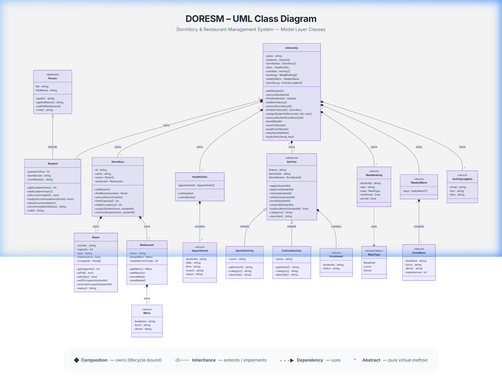

<div align="center">

# 🏛️ DORESM

### **Dormitory & Restaurant Management System**

A comprehensive Qt6/C++17 desktop application for managing university dormitories, restaurants, student accommodation, health services, and extracurricular activities.

[](https://en.cppreference.com/w/cpp/17)
[](https://www.qt.io/)
[](https://cmake.org/)
[](LICENSE)

</div>

---

## 📋 Table of Contents

- [Overview](#-overview)
- [Features](#-features)
- [Architecture](#-architecture)
- [UML Class Diagram](#-uml-class-diagram)
- [Project Structure](#-project-structure)
- [Prerequisites](#-prerequisites)
- [Build & Run](#-build--run)
- [User Roles & Credentials](#-user-roles--credentials)
- [Input Validation](#-input-validation)
- [Software Engineering Principles](#️-software-engineering-principles)
- [Design Patterns](#-design-patterns)
- [Data Persistence](#-data-persistence)
- [License](#-license)

---

## 🔍 Overview

**DORESM** is a multi-role university management system that provides separate dashboards and functionality for four distinct user types: **Administrators**, **Dormitory Admins**, **Staff**, and **Students**. The system handles the complete lifecycle of dormitory management — from room allocation and maintenance tracking to restaurant menu planning, meal booking, health clinic appointments, and activity enrollment.

Built with **pure C++17** and **Qt6 Widgets**, the application features a modern, polished UI with a sidebar navigation pattern, responsive card-based layouts, and comprehensive input validation with user-friendly error messages.

---

## ✨ Features

### 🔐 Authentication System
- Multi-role login (Admin, Dorm Admin, Staff, Student)
- Per-dormitory staff accounts (Staff A → Dormitory A, etc.)
- Auto-generated credentials file (`data/credentials.txt`)
- Secure role-based access control

### 🏢 Dormitory Management
- Create, view, and delete dormitories (single-letter IDs: A-Z)
- Add/remove rooms with validated room numbers (`X-NNN` format)
- Room capacity management (Single / Double / Triple)
- Room occupancy tracking and status indicators

### 🛏️ Room & Accommodation
- Assign students to rooms with capacity checks
- Reassign and unassign students
- Maintenance mode toggle for rooms
- Advanced filtering (by dormitory, type, status, student, room number)

### 👥 Student Management
- Add/edit/remove students with validated IDs (digits only)
- Full name validation (first + last name required)
- Academic year tracking (1–5)
- Accommodation status overview
- Filtering by ID, name, dormitory, and year

### 🍽️ Restaurant & Meal System
- Weekly menu editor (7 days × 3 meals)
- Meal booking system with future-date validation
- Meal serving workflow for staff
- Per-dormitory restaurant scoping

### 🏥 Health Clinic
- Appointment scheduling with date (dd-mm-yyyy) and time (HH:MM) validation
- Appointment status tracking (Scheduled / Completed / Cancelled)
- Student and admin appointment views

### ⚽ Activities & Events
- Sports and Cultural activity categories
- Student enrollment system with approval workflow (Pending → Approved / Refused)
- Coach and venue management
- Activity browsing for students

### 📊 Dashboard
- Real-time statistics (students, rooms, occupancy, activities)
- Recent activity log with emoji indicators
- Quick navigation to all management modules

### 🗑️ Recycle Bin (Archive)
- Safe deletion with confirmation dialogs across the application
- Dedicated "Recycle Bin" page to view all deleted students, rooms, and dormitories
- Restore functionality (restoring a dormitory automatically restores its rooms)
- Permanent deletion and "Empty Recycle Bin" options
- Persistent archive data across application restarts

---

## 🏗️ Architecture

DORESM follows a clean **two-layer architecture** separating business logic from presentation:

```
┌────────────────────────────────────────────────────┐
│                    GUI LAYER                        │
│  ┌──────────┐ ┌──────────┐ ┌──────────┐ ┌────────┐│
│  │  Admin    │ │ Student  │ │  Staff   │ │  Dorm  ││
│  │  Window   │ │  Window  │ │  Window  │ │ Admin  ││
│  │ (8 pages) │ │(4 pages) │ │(3 pages) │ │(8 pgs) ││
│  └────┬─────┘ └────┬─────┘ └────┬─────┘ └───┬────┘│
│       └─────────────┴────────────┴───────────┘     │
│                        │                            │
│              ┌─────────▼─────────┐                  │
│              │   LoginWindow     │                  │
│              │  (authentication) │                  │
│              └───────────────────┘                  │
├────────────────────────────────────────────────────┤
│                   MODEL LAYER                       │
│  ┌────────────────────────────────────────────────┐│
│  │              University (Façade)                ││
│  │  ┌──────────┐ ┌──────────┐ ┌──────────────┐   ││
│  │  │Student[] │ │Dormitory[]│ │ HealthClinic │   ││
│  │  │(Person↑) │ │ Room[]   │ │ Appointment[]│   ││
│  │  │          │ │Restaurant│ │              │   ││
│  │  └──────────┘ └──────────┘ └──────────────┘   ││
│  │  ┌──────────┐ ┌──────────┐ ┌──────────────┐   ││
│  │  │Activity[]│ │MealBook[]│ │  WeeklyMenu  │   ││
│  │  │Sports↑   │ │          │ │  DailyMenu[7]│   ││
│  │  │Cultural↑ │ │          │ │              │   ││
│  │  └──────────┘ └──────────┘ └──────────────┘   ││
│  └────────────────────────────────────────────────┘│
│                        │                            │
│              ┌─────────▼─────────┐                  │
│              │  File Persistence │                  │
│              │  (data/*.txt)     │                  │
│              └───────────────────┘                  │
└────────────────────────────────────────────────────┘
```

---

## 📐 UML Class Diagram

The model layer contains **18 classes and structs** with inheritance, composition, and polymorphism:

<div align="center">
  
</div>

> An interactive version is also available: open `uml_class_diagram.html` in any browser.

### Key Relationships

| Relationship | Type | Description |
|---|---|---|
| `Person` → `Student` | **Inheritance** | Student extends abstract Person |
| `Activity` → `SportsActivity` / `CulturalActivity` | **Inheritance** | Polymorphic activity types |
| `University` ◆→ `Dormitory[]` | **Composition** | University owns dormitories |
| `Dormitory` ◆→ `Room[]` + `Restaurant` | **Composition** | Each dorm has rooms and a restaurant |
| `University` ◆→ `HealthClinic` | **Composition** | Single clinic instance |
| `Activity` ◆→ `Enrollment[]` | **Composition** | Activities own their enrollments |

---

## 📁 Project Structure

```
DORESM/
├── CMakeLists.txt              # Build configuration (Qt6 + CMake)
├── main.cpp                    # Application entry point & login flow
├── style.h                     # Global stylesheet (modern dark sidebar + cards)
│
├── model/                      # ── Business Logic Layer ──
│   ├── Person.h                # Abstract base class (id, fullName, role)
│   ├── Student.h/.cpp          # Student with accommodation & academic year
│   ├── Room.h/.cpp             # Room with occupants & maintenance
│   ├── Dormitory.h/.cpp        # Dormitory owning Rooms + Restaurant
│   ├── Restaurant.h            # Restaurant with today's menu
│   ├── Menu.h                  # Daily menu struct (breakfast/lunch/dinner)
│   ├── WeeklyMenu.h            # 7-day menu struct
│   ├── MealBooking.h           # Meal booking struct
│   ├── Activity.h/.cpp         # Abstract Activity + Sports/Cultural subclasses
│   ├── HealthClinic.h/.cpp     # Clinic with appointment scheduling
│   ├── Common.h/.cpp           # MealType enum + utilities
│   └── University.h/.cpp       # Central façade: all data + persistence
│
├── gui/                        # ── Presentation Layer ──
│   ├── LoginWindow.h/.cpp      # Multi-role authentication UI
│   ├── MainWindow.h/.cpp       # Admin main window (sidebar + 9 pages)
│   ├── StudentWindow.h/.cpp    # Student portal (sidebar + 4 pages)
│   ├── StaffWindow.h/.cpp      # Staff portal, scoped to one dormitory
│   ├── DormAdminWindow.h/.cpp  # Dorm admin portal, scoped to one dormitory
│   ├── pages.h/.cpp            # All admin page implementations
│   ├── StudentPages.h/.cpp     # Student page implementations
│   ├── StaffPages.h/.cpp       # Staff page implementations
│   ├── DormAdminPages.h/.cpp   # Dorm admin page implementations
│   ├── widgets.h/.cpp          # Reusable UI components (cards, pills, headers)
│   └── Validation.h            # Centralized input validation utilities
│
├── data/                       # ── Persisted Data (auto-generated) ──
│   ├── credentials.txt         # Auto-generated login reference
│   ├── dormitories.txt         # Dormitory definitions
│   ├── rooms.txt               # Room data
│   ├── students.txt            # Student records
│   ├── bookings.txt            # Meal bookings
│   ├── appointments.txt        # Health appointments
│   ├── activities.txt          # Activity definitions
│   ├── menu.txt                # Weekly menu data
│   └── archive.txt             # Recycle bin / deleted items archive
│
├── uml_class_diagram.png       # UML class diagram (image)
└── uml_class_diagram.html      # UML class diagram (interactive)
```

---

## ⚙️ Prerequisites

| Requirement | Version |
|---|---|
| **C++ Compiler** | C++17 compatible (GCC 9+, MSVC 2019+, Clang 10+) |
| **Qt** | 6.x (Qt Widgets module) |
| **CMake** | 3.16 or higher |

---

## 🔨 Build & Run

### 1. Clone the repository

```bash
git clone https://github.com/your-username/doresm.git
cd doresm
```

### 2. Configure and build

```bash
# Create build directory
cmake -B build -DCMAKE_PREFIX_PATH=/path/to/Qt/6.x/gcc_64

# Build
cmake --build build

# Run
./build/doresm          # Linux/macOS
.\build\doresm.exe      # Windows
```

### 3. First launch

On first launch, the application automatically:
- Seeds sample data (4 dormitories, 5 students, activities, appointments)
- Generates `data/credentials.txt` with all login credentials
- Creates the `data/` directory with all persistence files

---

## 👤 User Roles & Credentials

The system supports **four user roles**, each with their own portal:

### Default Credentials

| Role | Username | Password | Access Level |
|---|---|---|---|
| **Admin** | `admin` | `admin` | Full system management |
| **Staff A** | `Staff A` | `staffA` | Dormitory A operations |
| **Staff B** | `Staff B` | `staffB` | Dormitory B operations |
| **Staff C** | `Staff C` | `staffC` | Dormitory C operations |
| **Staff D** | `Staff D` | `staffD` | Dormitory D operations |
| **Dorm Admin A** | `Dormitory A` | `A` | Dormitory A management |
| **Dorm Admin B** | `Dormitory B` | `B` | Dormitory B management |
| **Student** | `Ahmed Benali` | `001` | Personal student portal |
| **Student** | `Sara Khelifi` | `002` | Personal student portal |

> Full credentials are always available in `data/credentials.txt` (auto-regenerated on save).

### Role Capabilities

| Feature | Admin | Dorm Admin | Staff | Student |
|---|:---:|:---:|:---:|:---:|
| Manage dormitories | ✅ | — | — | — |
| Manage rooms | ✅ | ✅ (own dorm) | — | — |
| Manage students | ✅ | 👁️ (read-only) | — | — |
| Assign accommodation | ✅ | ✅ (own dorm) | — | — |
| Edit weekly menu | ✅ | — | — | — |
| Serve meals | — | — | ✅ | — |
| Toggle maintenance | ✅ | ✅ | ✅ | — |
| Book meals | ✅ | — | — | ✅ |
| Schedule appointments | ✅ | — | — | ✅ |
| Manage activities | ✅ | — | — | — |
| Apply to activities | — | — | — | ✅ |
| View dashboard | ✅ | ✅ | ✅ | ✅ |

---

## ✅ Input Validation

All user inputs are validated with clear, descriptive error messages. Invalid entries trigger a re-prompt with the previous value preserved.

| Field | Rule | Example |
|---|---|---|
| **Student ID** | Digits only | `001`, `042`, `1234` |
| **Student Name** | First + last name, letters/spaces/hyphens only | `Ahmed Benali` |
| **Dormitory ID** | Single uppercase letter (A–Z) | `E` |
| **Room Number** | `X-NNN` (dormitory letter + 3 digits) | `A-101`, `B-205` |
| **Date** | `dd-mm-yyyy` format, must be valid | `17-06-2026` |
| **Future Date** | Same as above, must be today or later | `25-12-2026` |
| **Time** | `HH:MM` 24-hour format (00:00–23:59) | `09:00`, `14:30` |
| **Menu Items** | Non-empty text | `Bread, Jam, Coffee` |
| **Activity Name** | 2–60 characters | `Football Training` |

> Validation logic is centralized in [`gui/Validation.h`](gui/Validation.h).

---

## 🛠️ Software Engineering Principles

This project was built adhering to core software engineering principles to ensure maintainability, security, and robustness:

- **Authentication & Authorization**: Secure, role-based access control (RBAC). Users are authenticated against their role, and authorized to see only the data and actions relevant to them (e.g., a Dormitory Admin can only manage their specific dormitory).
- **Data Persistence**: A robust, lightweight file-based storage system that ensures state is seamlessly saved and restored across application sessions without requiring an external database.
- **Data Integrity**: Strict enforcement of business rules at the model layer (e.g., preventing the assignment of students to full rooms, preventing the deletion of occupied dormitories, and cascading unassignments when a dormitory is archived).
- **Soft Deletion & Archiving**: Implementation of a "Recycle Bin" allowing users to safely recover from accidental deletions, ensuring critical records aren't permanently lost by mistake.
- **Edge Case Handling**: Comprehensive defensive programming. The system gracefully handles missing files, malformed user inputs, scheduling conflicts, and prevents duplicate unique IDs.
- **Separation of Concerns (SoC)**: Strict division between the Model layer (business logic/data) and the GUI layer (presentation), ensuring that UI changes don't affect underlying business rules.

---

## 🧩 Design Patterns

| Pattern | Implementation |
|---|---|
| **Inheritance & Polymorphism** | `Person` → `Student` (virtual `role()`); `Activity` → `SportsActivity` / `CulturalActivity` (virtual `category()`, `describe()`) |
| **Composition** | `Dormitory` owns `Room[]` + `Restaurant`; `University` owns all domain objects |
| **Façade** | `University` provides a single interface for all data operations, persistence, and queries |
| **MVC** | Model layer (data classes) + GUI layer (pages act as view-controllers) |
| **Interface Segregation** | `Refreshable`, `StudentRefreshable`, `StaffRefreshable`, `DormAdminRefreshable` — separate refresh interfaces per role |
| **Observer (Qt Signals/Slots)** | Login signals (`adminLoggedIn`, `studentLoggedIn`, etc.) drive window switching |
| **Strategy** | Different page implementations plugged into the same `QStackedWidget` |

---

## 💾 Data Persistence

All data is persisted to plain-text files in the `data/` directory using a pipe-delimited (`|`) format:

```
# Example: students.txt
001|Ahmed Benali|2|A|A-101
002|Sara Khelifi|1|A|A-101
003|Karim Boudiaf|3|B|B-202
```

- **Auto-save**: Data is saved on logout and on `closeEvent`
- **Auto-load**: Data is loaded from files on startup if they exist
- **Seed data**: If no data files exist, sample data is generated automatically
- **Credentials**: `credentials.txt` is regenerated every time data is saved

---

## 📄 License

This project is developed for educational purposes as part of a university course.

---

<div align="center">

**Built with ❤️ using C++17 and Qt6**

</div>
